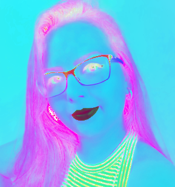

# Sobre o Projeto

O projeto foi criado com o intuito de demonstrar o que foi aprendido na cadeira de Processamento de Imagens.

# Proposta do Projeto

### Criar um Stories do "Instagram"

1. Este projeto tem como objetivo desenvolver uma pequena aplicação que que simule os efeitos e funcionalidades ao estilo Instagram.

2. A aplicação deve permitir ao usuário:
  - Carregar uma imagem ou vídeo
  - Aplicar diferentes filtros (você deve oferecer pelo menos 4 opções diferentes)
  - Adicionar stickers (figurinhas predefinidas)
  - Adicionar outro elemento a sua escolha (gif, texto, temperatura, local, selfie, etc...)
  - Salvar a foto ou vídeo editado
  - Interação por teclado e/ou mouse

# Obrigatoriedade
- Utilizar OpenCV na sua linguagem de preferência

# Como utilizar a aplicação

# Sobre o código
A tela do sistema interativa que permite interação com mouse foi desenvolvida usando uma biblioteca Pyhton chamada ![][Tkinter](https://docs.python.org/3/library/tkinter.html) que permite fazer uma tela GUI com opção de janelas.

 e  que permite adicionar efeitos nas images e capturas através de atalhos de teclado sendo eles: *1 - Tons de Cinza, 2 - Radioativo, 3 - Pintura, 4 - Luminosidade e 5 - Detecção de cores vermelhas*.

<table align="center">
  <tr>
    <th>Original</th>
    <th>Tons de Cinza</th>
    <th>Radioativo</th>
    <th>Pintura</th>
    <th>Luminosidade</th>
    <th>Detecção de Cores Vermelhas</th>
    </tr>
  <tr>
    <td align="center"></td>
    <td align="center"></td>      
    <td align="center"></td>
    <td align="center"></td>
    <td align="center"></td>
    <td align="center"></td>
  </tr>
</table>

![][PNGs dos Filtros](https://www.pngegg.com/)
![][Icones da Tela](https://www.iconsdb.com/)
