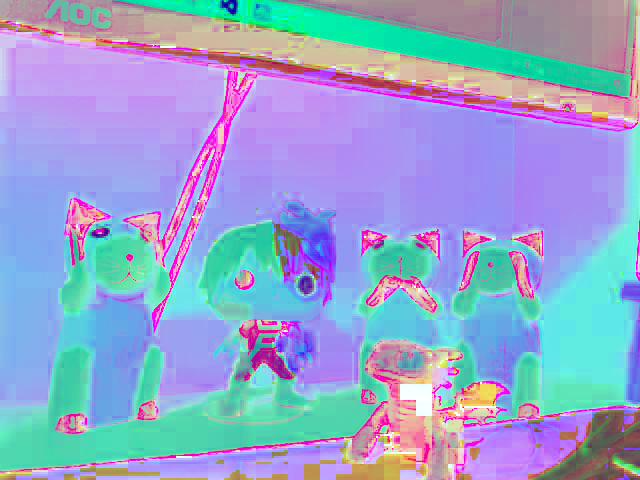
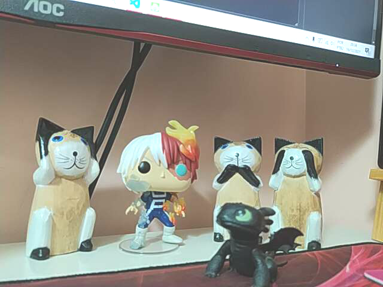

# :computer: Sobre o Projeto

O projeto foi criado com o intuito de demonstrar o que foi aprendido na materia de Computação Gráfica e Processamento de Imagens.

# :page_facing_up: Proposta
<details>
  <summary><b>Criar um Stories do "Instagram"</b></summary><br />
  
  1. Este projeto tem como objetivo desenvolver uma pequena aplicação que que simule os efeitos e funcionalidades ao estilo Instagram.

  2. A aplicação deve permitir ao usuário:
      - Carregar uma imagem ou vídeo
      - Aplicar diferentes filtros (você deve oferecer pelo menos 4 opções diferentes)
      - Adicionar stickers (figurinhas predefinidas)
      - Adicionar outro elemento a sua escolha (gif, texto, temperatura, local, selfie, etc...)
      - Salvar a foto ou vídeo editado
      - Interação por teclado e/ou mouse
  
  ### Obrigatoriedade
   - Utilizar OpenCV na sua linguagem de preferência.
</details>

# :speech_balloon: Linguagem usada
A linguagem escolhida para esse projeto foi o [Python](https://python.org.br/), que possui diversos materiais vinculados [OpenCV](https://docs.opencv.org/4.x/d6/d00/tutorial_py_root.html) que torna o estudo de Computação Gráfica mais prático, mesmo sendo um conteúdo de Processamento de Imagens sendo complexo.

# :electric_plug: O que precisa para usar a aplicação
- <b>Ambiente:</b> Necessita ter python instalado, OpenCV, TkInter e PIL. 
- <b>Ferramenta:</b> Utilizei o Visual Code como IDE para desenvolver e rodar a aplicação. 
- <b>Rodando o projeto:</b> A tela inicial é a [Menu Oficial](Oficial/menuOficial.py).
- <b>Outros:</b> Usar duas câmeras para poder executar função de inversão de câmera simulando a de perfil.

# :hammer_and_wrench: Como utilizar a aplicação

<details>
  <summary>Explicação detalhada de como utilizar e resultados</summary><br />
  
Ao executar o [Menu Oficial](Oficial/menuOficial.py) abre o menu com as opções de interação do InstaKath:

<p align="center">
  
</p>

Abaixo explico como funciona cada um dos botões do Menu:

<table align="center">
  <tr>
    <td></td>
    <td><b>O primeiro botão é para adicionar filtros em uma imagem pré-definida.<b></td>
  </tr>
  <tr>
    <td colspan="2">
      Ao carregar a tela com a imagem - clicar a <i>tecla 1</i>: <b>Adiciona o filtro em Tons de Cinza</b><br />
      Na mesma tela incial normal - clicar a <i>tecla 2</i>: <b>Adiciona o filtro Radiativo</b><br />
      Na mesma tela incial normal - clicar a <i>tecla 3</i>: <b>Adiciona o filtro Pintura</b><br />
      Na mesma tela incial normal - clicar a <i>tecla 4</i>: <b>Adiciona o filtro Luminosidade</b><br />
      Na mesma tela incial normal - clicar a <i>tecla 5</i>: <b>Adiciona o filtro Detecção de cores vermelhas</b><br />
    </td>
  </tr>
  <tr>
    <td colspan="2">
      Toda vez que clica no filtro salva a imagem no StoriesDownloads/Imagem
    </td>
  </tr>

  <table align="center">
  <tr>
    <th>Original</th>
    <th>Tons de Cinza</th>
    <th>Radioativo</th>
  </tr>  
  <tr>
    <td align="center"></td>
    <td align="center"></td>      
    <td align="center"></td>
  </tr>
  <tr>
    <th>Pintura</th>
    <th>Luminosidade</th>
    <th>Detecção de Cores Vermelhas</th>
  </tr>
  <tr>
    <td align="center"></td>
    <td align="center"></td>
    <td align="center"></td>
  </tr>
</table>

 <table align="center">
  <tr>
    <td></td>
    <td><b>O segundo botão é para adicionar filtros em capturas de vídeos.<b></td>
  </tr>
  <tr>
    <td colspan="2">
      Ao carregar a tela de vídeo - clicar a <i>tecla 1</i>: <b>Adiciona o filtro em Tons de Cinza</b><br />
      Na mesma tela incial normal - clicar a <i>tecla 2</i>: <b>Adiciona o filtro Radiativo</b><br />
      Na mesma tela incial normal - clicar a <i>tecla 3</i>: <b>Adiciona o filtro Pintura</b><br />
      Na mesma tela incial normal - clicar a <i>tecla 4</i>: <b>Adiciona o filtro Luminosidade</b><br />
      Na mesma tela incial normal - clicar a <i>tecla 5</i>: <b>Adiciona o filtro Detecção de cores vermelhas</b><br />
    </td>
  </tr>
  <tr>
    <td colspan="2">
      Toda vez que clica no filtro salva a imagem dos efeitos no StoriesDownloads/Imagem
    </td>
  </tr>

  <table align="center">
    <tr>
      <th>Tons de Cinza</th>
      <th>Radioativo</th>
    </tr>  
    <tr>
      <td align="center"></td>      
      <td align="center"></td>
    </tr>
    <tr>
      <th>Pintura</th>
      <th>Luminosidade</th>
    </tr>
    <tr>      
      <td align="center"></td>
      <td align="center"></td>
    </tr>
    <tr> 
      <th colspan="2">Detecção de Cores Vermelhas</th>
    </tr>  
    <tr>
      <td align="center" colspan="2"></td>
    </tr>
  </table>

 <table align="center">
  <tr>
    <td></td>
    <td><b>O terceiro botão é para adicionar filtros em capturas de vídeos, só que com outra câmera.</td>
  </tr>
  <tr>
    <td colspan="2">
      Ao carregar a tela de vídeo - clicar a <i>tecla 1</i>: <b>Adiciona o filtro em Tons de Cinza</b><br />
      Na mesma tela incial normal - clicar a <i>tecla 2</i>: <b>Adiciona o filtro Radiativo</b><br />
      Na mesma tela incial normal - clicar a <i>tecla 3</i>: <b>Adiciona o filtro Pintura</b><br />
      Na mesma tela incial normal - clicar a <i>tecla 4</i>: <b>Adiciona o filtro Luminosidade</b><br />
      Na mesma tela incial normal - clicar a <i>tecla 5</i>: <b>Adiciona o filtro Detecção de cores vermelhas</b><br />
      Na mesma tela incial normal - clicar a <i>tecla 6</i>: <b>Salva a imagem do filtro que está usando.</b><br />
    </td>
  </tr>
  <tr>
    <td colspan="2">
      Toda vez que clica no filtro salva a imagem dos efeitos no StoriesDownloads/Imagem
    </td>
  </tr>

  <table align="center">
    <tr>
      <th>Tons de Cinza</th>
      <th>Radioativo</th>
    </tr>  
    <tr>
      <td align="center"></td>      
      <td align="center"></td>
    </tr>
    <tr>
      <th>Pintura</th>
      <th>Luminosidade</th>
    </tr>
    <tr>      
      <td align="center"></td>
      <td align="center"></td>
    </tr>
    <tr> 
      <th colspan="2">Detecção de Cores Vermelhas</th>
    </tr>  
    <tr>
      <td align="center" colspan="2"></td>
    </tr>
  </table>

   <table align="center">
  <tr>
    <td></td>
    <td><b> O quarto botão é para adicionar filtros em capturas de vídeos adicionando acessórios em tempo real.</td>
  </tr>
  <tr>
    <td colspan="2">
      Ao carregar a tela de vídeo - clicar a <i>tecla 1</i>: <b>Adiciona um filtro Chapéu de Formanda</b><br />
      Na mesma tela incial normal - clicar a <i>tecla 2</i>: <b>Adiciona um filtro com guampinhas de Diabinho</b><br />
      Na mesma tela incial normal - clicar a <i>tecla 3</i>: <b>Adiciona um filtro com uma coroa</b><br />
      Na mesma tela incial normal - clicar a <i>tecla 4</i>: <b>Adiciona um filtro com um sombrero</b><br />
      Na mesma tela incial normal - clicar a <i>tecla 5</i>: <b>Adiciona um filtro Detecção de cores vermelhas</b><br />
      Na mesma tela incial normal - clicar a <i>tecla 6</i>: <b>Salva a imagem do filtro que está usando.</b><br />
    </td>
  </tr>
  <tr>
    <td colspan="2">
      Toda vez que clica no filtro salva a imagem dos efeitos no StoriesDownloads/Imagem e um vídeo de todo o processo desde que iniciou o sistema StoriesDownloads/Video
    </td>
  </tr>

  <table align="center">
    <tr>
      <th>Chapéu de Formanda</th>
      <th>Diabinha</th>
    </tr>
    <tr>
      <td align="center"></td>
      <td align="center"></td>
    </tr>    
    <tr>
      <th>Rainha</th>
      <th>Chapéu de Natal</th>
    </tr>  
    <tr>
      <td align="center"></td>  
      <td align="center"></td>
    </tr>   
    <tr>
      <th colspan="2">Sombrero</th>
    </tr>  
    <tr>
      <td align="center" colspan="2"></td>
    </tr>
  </table>

  [Vídeo Gravado](ImagensReadme/graduateVideo.mp4)
</details>

# :woman_technologist: Sobre o código

<details>
  <summary>Explicação detalhada do código</summary><br />
  
A tela do sistema que permite interação com mouse foi desenvolvida usando uma biblioteca Pyhton chamada [Tkinter](https://docs.python.org/3/library/tkinter.html) que permite fazer uma tela GUI com opção de janelas.

O TkInter tem funções próprias que facilitam a montagem de uma tela de uma tela, como `title` para adicionar um título a janela criada, `wm_iconbitmap` que permite impotar uma imagem de extensão .ico para substituir o ícone padrão do TkInter,`geometry` defini a dimensão da janela inicial, `resizable` que permite alterar o tamanho da janelo caso utilize o mouse para aumentar a janela, `Button` que cria um botão que pode adicionar ações passando no paramentro `command`. Abaixo parte do código do [Menu Oficial](Oficial/menuOficial.py) para entender as funcionalidade explicadas:

```bash
  window = tk.Tk()
  window.title("InstaKath")
  window.wm_iconbitmap('Icons/instakath.ico')
  window.geometry("250x500")
  window.resizable(True, True)  
  ...

  tk.Button(master=window, image= galleryImage, text= "Imagem \nFiltros", 
            bg='#6824a3', fg="white", command=imageFilter, 
            padx=10, pady=15, justify=CENTER).place(x=100, y=100)
```

Para cada uma das funções criei uma classe para cada interação: [Filtro em Imagem](Oficial/imageFilter.py), [Filtro na Captura de Vídeo para as Duas Câmeras](Oficial/changeCamera.py) e [Captura de Vídeo Adicionando Chapéus](Oficial/cameraFiltroAccessory.py).
___  

Para a primeira ação do menu o [Filtro em Imagem](Oficial/imageFilter.py) usei funções da biblioteca OpenCV: `imread` lê a imagem que foi passado o caminho para ela, `resize` para redimencionar uma imagem recebida, `waitKey` para capturar entrada de informação via teclado, `imshow` para abrir uma janela nova com o filtro aplicado na imagem, `imwrite` para salvar a imagem alterada. Criei uma função para redimensionar porque a imagem sempre abria muito grande para poder visualizar.

Se encontra a imagem redimenciona, espera uma interação do usuário que ao precionar qualquer uma das seguintes teclas: 1 - Tons de Cinza, 2 - Radiativo, 3 - Pintura, 4 -Luminosidade e 5 - Detecção de cores vermelhas, chamando o filtro repectivo a tecla pressinada chamando funções de [colorFilter](Oficial/colorFilter.py) que explicarei logo após esse código. Depois de aplicado o efeito, mostra em uma tela a parte o filtro aplicado e salva essa imagem em `StoriesDownloads/images/` para sair da tela basta apertar a tecla 'q' para utlizar as outras ações.

```bash
image = cv2.imread('StoriesUploads/teste.png')

class FilterImage():
  def __init__(self):
    def resizeImage(imagem):
      porcetagem_escala = 10
      comprimento = int(imagem.shape[1] * porcetagem_escala / 100)
      altura = int(imagem.shape[0] * porcetagem_escala / 100)
      dimensao_imagem = (comprimento, altura)
      return cv2.resize(imagem, dimensao_imagem, interpolation = cv2.INTER_AREA)

    while(True):
      imageResized = resizeImage(image)

      key = cv2.waitKey(10)

      if key != -1:
        key = chr(key)

      if key == '\x1b':
        break

      if key == '1':
        maskgreyscale = colorFilter.greyscale(imageResized)
        cv2.imshow('Tons de Cinza', maskgreyscale)
        cv2.imwrite('StoriesDownloads/images/maskgreyscale.png', maskgreyscale)
      elif key == '2':      
        radioactive = colorFilter.invertmask(imageResized)
        cv2.imshow('Radioativo', radioactive)
        cv2.imwrite('StoriesDownloads/images/radioactive.png', radioactive)
      elif key == '3':      
        painting = colorFilter.painting(imageResized)
        cv2.imshow('Pintura', painting)
        cv2.imwrite('StoriesDownloads/images/painting.png', painting)
      elif key == '4':      
        light = colorFilter.light(imageResized)
        cv2.imshow('Luminosidade', light)
        cv2.imwrite('StoriesDownloads/images/light.png', light)
      elif key == '5':      
        rouge = colorFilter.rouge(imageResized)
        cv2.imshow('Deteccao de Cores Vermelhas', rouge)
        cv2.imwrite('StoriesDownloads/images/rouge.png', rouge)

      if cv2.waitKey(1) & 0xFF == ord('q'):
        break

      cv2.imshow('Imagem Filtro',imageResized)
      if cv2.waitKey(1) & 0xFF == ord('q'):
        break

    cv2.waitKey(0)
    cv2.destroyAllWindows()
```
___
  
Os [filtros](Oficial/colorFilter.py) todos utilizei funções próprias do OpenCV que já aplicam a modificação na imagem:

*Tons de Cinza*

Com a função do OpenCV `cvtColor` passa a imagem que quer alterada e o `COLOR_BGR2GRAY` converte imagem RGB para BRG e cor Cinza.

```bash
  def greyscale(img):
    greyscale = cv2.cvtColor(img, cv2.COLOR_BGR2GRAY)
    return greyscale
```
  
*Radiativo*

Para esse filtro converte a imagem RGB para BGR para HSV que pega o valor de saturação de matiz, depois usa o `bitwise_not` que inverte os valores dos pixels.

```bash
  def invertmask(img):
    imghsv = cv2.cvtColor(img, cv2.COLOR_BGR2HSV)
    invertmask = cv2.bitwise_not(imghsv)
    return invertmask
```
  
*Pintura*

Nesse filtro utilizo do k-means para calcular dados em um conjunto maior e transformá-lo em um menor com a ideia de compactação de dados. Então esse algoritmo identifica vetores em um conjunto, encontra o ponto central de cada um deles formando um conjunto menor com todos os pontos indificados cuja sua distância para o próximo ponto seja menor em relação a distância do próximo ponto central.

Insero uma imagem que se não for nula definiamos a ela a quantidade de `NCLUSTERS` que é a quntidade de cores que serão identificadas na imagem, no caso atribui o valor 10. A `NRODADAS` defini quantas vezes essa imagem vai ser analisada novamente, no exemplo faremos apenas 1 vez para entender como a imagem está se comportando no resultado final.
  
  ```bash
    NCLUSTERS = 10
    NRODADAS = 10
  ```
  
Depois separa as informações da imagem inserida pegando sua Altura(`height`), Largura(`width`) e Canais de Cores(`channels`) e logo em seguida se calcula uma amostra da imagem identificando todos os pixels dela. Então o `sample` é toda é o total de linhas vinculados a um total de pixels em 3 colunas que representam o (R, G, B).

  ```bash
        height, width, channels = imagem.shape
        samples = np.zeros([height*width, 3], dtype = np.float32)
  
        count = 0

        for x in range(height):
            for y in range(width):
                samples[count] = imagem[x][y]
                count += 1
  ```
  
  Calculado a quantidade de pixels por cor é feito o calculo abaixo de k-means que utiliza a amostra da imagem (`sample`), número de cores analisadas, o terceiro parmetro no kmeans do python utiliza a melhor camada, nesse exemplo não vamos utilizar esse parâmetro, por isso está atribuido `None`. No quarto parâmentro verificasse o critério de identificação dos núcleos de cada pixel, usando varíaveis próprias do openCv `cv2.TERM_CRITERIA_EPS` e `cv2.TERM_CRITERIA_MAX_ITER` para identificar seus limites definimos o total de interações para identificá-las no caso 10000 e a margem de tolerância de cor que é para retornar 0.0001. o quinto parâmentro `NRODADAS` de quantas vezes essa imagem  será analisada e o `cv2.KMEANS_PP_CENTERS` que é um parâmentro openCV que já carrega os pontos centrais do que é encontrado na imagem de form ordenda.
  
  ```bash    
        compactness, labels, centers = cv2.kmeans(samples,
                                            NCLUSTERS, 
                                            None,
                                            (cv2.TERM_CRITERIA_EPS + cv2.TERM_CRITERIA_MAX_ITER, 10000, 0.0001), 
                                            NRODADAS, 
                                            cv2.KMEANS_PP_CENTERS)
  ```
  Para finalizar utiliza-se todos os pontos centrais para criar um vetor de centróides para ser identificado na imagem e retorna a imagem resutado após essa análise.
  
  ```bash    
    centers = np.uint8(centers)
    res = centers[labels.flatten()]
    painting = res.reshape((img.shape))
    return painting

  ```

*Luminosidade*

Esse filtro usa o `convertScaleAbs` também OpenCV que dimensiona e calcula valores absolutos e converte o resultado em 8 bits. No primeiro parametro aparece a imagem para ser alterada e o segundo parametro aumenta o valor de escala, então dá a impressão de aumento e diminuição de luz, no caso se encontra fixo no valor de 50.

```bash
  def light(img):
    light = cv2.convertScaleAbs(img, beta=50)
    return light
```

*Detecção de Cores Vermelhas*

Nesse filtro converte a imagem RGB para BGR para HSV e adiciona variável 'imagehsv', e na variável 'gray' coloca RGB para BGR para tons de cinza, no 'lowerRed' e 'uppeRed' defino os tons de vermelho que quero identificar e aplico na função `inRange` do OpenCV que retorna uma matriz de elementos igual a 255 se os elementos de uma determinada matriz estiverem entre as duas matrizes que representam os limites superiores e inferiores seto na variável 'mask', na 'maskInv' uso novamente a função `bitwise_not` para inverter os tons de pixels contruio um 'background' que compara os pixels da imagem com a da máscara e uso o `stack` do Numpy que junta uma sequência de matrizes ao longo de um novo eixo. E na variável 'rouge' adicion0 duas imagens, destacando assim os tons vermelhos na imagem.

```bash
  def rouge(img):
    imagehsv = cv2.cvtColor(img, cv2.COLOR_BGR2HSV)
    gray = cv2.cvtColor(img, cv2.COLOR_BGR2GRAY)
    lowerRed = np.array([160,100,50])
    uppeRed = np.array([180,255,255])
    mask = cv2.inRange(imagehsv, lowerRed, upperRed)
    maskInv = cv2.bitwise_not(mask)
    res = cv2.bitwise_and(img, img, mask=mask)
    background = cv2.bitwise_and(gray, gray, mask = maskInv)
    background = np.stack((background,)*3, axis=-1)
    rouge = cv2.add(res, background)
  
    return rouge
``` 
___
  
Para as funcionalidades de Filtro com câmera: [Filtro Câmera Principal e Secundárias](Oficial/changeCamera.py) o código é semelhante ao de [Filtro de Imagem](Oficial/imageFilter.py) e adiciona os mesmos filtros, mudando apenas que recebe uma captura de vídeo e dependendo do que o usuário escolheu passa qual a câmera que está sendo usada que pode ser identificado lá em [Menu Principal](Oficial/menuOficial.py) onde chama a função.

```bash
def video():  
  ChangeVideo(cv2.VideoCapture(0))

def changeVideo():
  ChangeVideo(cv2.VideoCapture(2))
```
E também grava um vídeo do que o usário está fazendo em 'StoriesDownloads/video/'.

```bash
  fourcc = cv2.VideoWriter_fourcc(*'XVID')
  out = cv2.VideoWriter('StoriesDownloads/video/videoFiltros.mp4',fourcc, 20.0, (640,480))
```
</details>

# :rocket: Melhorias

Em um futuro não muito distante:
- [ ] Melhorar a aplicação para deixar o mais semelhante ao stories do Instagram
- [ ] Colocar atalhos de teclado como bind nos botões
- [ ] Salvar vídeo somente quando clicar em um botão para iniciar
- [ ] Adicionar mais filtros
     
# :woman_student: Curiosidade
     
A pessoa de todas as imagens (no caso eu mesma) realmente está se formando, por isso o motivo da felicidade.
<p align="center">
  
</p>

# :books: Fontes das Imagens

[PNGs dos Filtros](https://www.pngegg.com/)

[Icones da Tela](https://www.iconsdb.com/)
