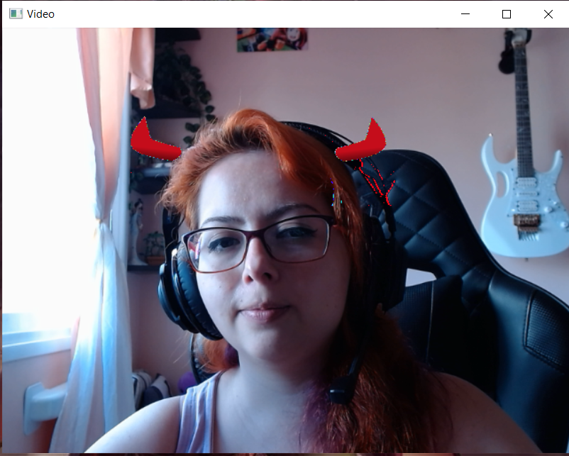

# Sobre o Projeto

O projeto foi criado com o intuito de demonstrar o que foi aprendido na cadeira de Processamento de Imagens.

# Proposta do Projeto

### Criar um Stories do "Instagram"

1. Este projeto tem como objetivo desenvolver uma pequena aplicação que que simule os efeitos e funcionalidades ao estilo Instagram.

2. A aplicação deve permitir ao usuário:
  - Carregar uma imagem ou vídeo
  - Aplicar diferentes filtros (você deve oferecer pelo menos 4 opções diferentes)
  - Adicionar stickers (figurinhas predefinidas)
  - Adicionar outro elemento a sua escolha (gif, texto, temperatura, local, selfie, etc...)
  - Salvar a foto ou vídeo editado
  - Interação por teclado e/ou mouse

# Obrigatoriedade
- Utilizar OpenCV na sua linguagem de preferência

# Como utilizar a aplicação
Necessita ter python instalado, OpenCV, TkInter e PIL. Rodar o projeto a partir do arquivo [Menu Oficial](Oficial/menuOficial.py), se possível utilizar duas câmeras para a troca de câmera.
  
# Sobre o código
A tela do sistema interativa que permite interação com mouse foi desenvolvida usando uma biblioteca Pyhton chamada [Tkinter](https://docs.python.org/3/library/tkinter.html) que permite fazer uma tela GUI com opção de janelas.

  

Abaixo explico como funciona cada um dos botões do Menu:

<table align="center">
  <tr>
    <td></td>
    <td><b>O primeiro botão é para adicionar filtros em uma imagem pré-definida.<b></td>
  </tr>
  <tr>
    <td colspan="2">
      Ao carregar a tela com a imagem - clicar a <i>tecla 1</i>: <b>Adiciona o filtro em Tons de Cinza</b> 
      Na mesma tela incial normal - clicar a <i>tecla 2</i>: <b>Adiciona o filtro Radiativo</b> 
      Na mesma tela incial normal - clicar a <i>tecla 3</i>: <b>Adiciona o filtro Pintura</b> 
      Na mesma tela incial normal - clicar a <i>tecla 4</i>: <b>Adiciona o filtro Luminosidade</b> 
      Na mesma tela incial normal - clicar a <i>tecla 5</i>: <b>Adiciona o filtro Detecção de cores vermelhas</b> 
    </td>
  </tr>
  <tr>
    <td colspan="2">
      Toda vez que clica no filtro salva a imagem no StoriesDownloads/Imagem
    </td>
  </tr>
      
  <table align="center">
  <tr>
    <th>Original</th>
    <th>Tons de Cinza</th>
    <th>Radioativo</th>
  </tr>  
  <tr>
    <td align="center"></td>
    <td align="center"></td>      
    <td align="center"></td>
  </tr>
  <tr>
    <th>Pintura</th>
    <th>Luminosidade</th>
    <th>Detecção de Cores Vermelhas</th>
  </tr>
  <tr>
    <td align="center"></td>
    <td align="center"></td>
    <td align="center"></td>
  </tr>
</table>

 <table align="center">
  <tr>
    <td></td>
    <td><b>O segundo botão é para adicionar filtros em capturas de vídeos.<b></td>
  </tr>
  <tr>
    <td colspan="2">
      Ao carregar a tela de vídeo - clicar a <i>tecla 1</i>: <b>Adiciona o filtro em Tons de Cinza</b> 
      Na mesma tela incial normal - clicar a <i>tecla 2</i>: <b>Adiciona o filtro Radiativo</b> 
      Na mesma tela incial normal - clicar a <i>tecla 3</i>: <b>Adiciona o filtro Pintura</b> 
      Na mesma tela incial normal - clicar a <i>tecla 4</i>: <b>Adiciona o filtro Luminosidade</b> 
      Na mesma tela incial normal - clicar a <i>tecla 5</i>: <b>Adiciona o filtro Detecção de cores vermelhas</b> 
    </td>
  </tr>
  <tr>
    <td colspan="2">
      Toda vez que clica no filtro salva a imagem dos efeitos no StoriesDownloads/Imagem
    </td>
  </tr>
  
  <table align="center">
    <tr>
      <th>Tons de Cinza</th>
      <th>Radioativo</th>
    </tr>  
    <tr>
      <td align="center"></td>      
      <td align="center"></td>
    </tr>
    <tr>
      <th>Pintura</th>
      <th>Luminosidade</th>
    </tr>
    <tr>      
      <td align="center"></td>
      <td align="center"></td>
    </tr>
    <tr> 
      <th colspan="2">Detecção de Cores Vermelhas</th>
    </tr>  
    <tr>
      <td align="center" colspan="2"></td>
    </tr>
  </table>

 <table align="center">
  <tr>
    <td></td>
    <td><b>O terceiro botão é para adicionar filtros em capturas de vídeos, só que com outra câmera.</td>
  </tr>
  <tr>
    <td colspan="2">
      Ao carregar a tela de vídeo - clicar a <i>tecla 1</i>: <b>Adiciona o filtro em Tons de Cinza</b> 
      Na mesma tela incial normal - clicar a <i>tecla 2</i>: <b>Adiciona o filtro Radiativo</b> 
      Na mesma tela incial normal - clicar a <i>tecla 3</i>: <b>Adiciona o filtro Pintura</b> 
      Na mesma tela incial normal - clicar a <i>tecla 4</i>: <b>Adiciona o filtro Luminosidade</b> 
    </td>
  </tr>
  <tr>
    <td colspan="2">
      Toda vez que clica no filtro salva a imagem dos efeitos no StoriesDownloads/Imagem
    </td>
  </tr>
  
  <table align="center">
    <tr>
      <th>Tons de Cinza</th>
      <th>Radioativo</th>
    </tr>  
    <tr>
      <td align="center"></td>      
      <td align="center"></td>
    </tr>
    <tr>
      <th>Pintura</th>
      <th>Luminosidade</th>
    </tr>
    <tr>      
      <td align="center"></td>
      <td align="center"></td>
    </tr>
    <tr> 
      <th colspan="2">Detecção de Cores Vermelhas</th>
    </tr>  
    <tr>
      <td align="center" colspan="2"></td>
    </tr>
  </table>
   
   <table align="center">
  <tr>
    <td></td>
    <td><b> O quarto botão é para adicionar filtros em capturas de vídeos adicionando acessórios em tempo real.</td>
  </tr>
  <tr>
    <td colspan="2">
      Ao carregar a tela de vídeo - clicar a <i>tecla 1</i>: <b>Adiciona um filtro Chapéu de Formanda</b> 
      Na mesma tela incial normal - clicar a <i>tecla 2</i>: <b>Adiciona um filtro com guampinhas de Diabinho</b> 
      Na mesma tela incial normal - clicar a <i>tecla 3</i>: <b>Adiciona um filtro com uma coroa</b> 
      Na mesma tela incial normal - clicar a <i>tecla 4</i>: <b>Adiciona um filtro com um sombrero</b> 
      Na mesma tela incial normal - clicar a <i>tecla 5</i>: <b>Adiciona um filtro Detecção de cores vermelhas</b> 
      Na mesma tela incial normal - clicar a <i>tecla 6</i>: <b>Salva a imagem do filtro que está usando.</b> 
    </td>
  </tr>
  <tr>
    <td colspan="2">
      Toda vez que clica no filtro salva a imagem dos efeitos no StoriesDownloads/Imagem e um vídeo de todo o processo desde que iniciou o sistema StoriesDownloads/Video
    </td>
  </tr>
  
  <table align="center">
    <tr>
      <th>Chapéu de Formanda</th>
      <th>Diabinha</th>
    </tr>
    <tr>
      <td align="center"></td>
      <td align="center"></td>
    </tr>    
    <tr>
      <th>Rainha</th>
      <th>Chapúe de Natal</th>
    </tr>  
    <tr>
      <td align="center"></td>  
      <td align="center"></td>
    </tr>   
    <tr>
      <th colspan="2">Sombrero</th>
    </tr>  
    <tr>
      <td align="center" colspan="2"></td>
    </tr>
  </table>
     
  [Vídeo Gravado](ImagensReadme/graduateVideo.mp4)

 

Fonte das Imagens:

[PNGs dos Filtros](https://www.pngegg.com/)

[Icones da Tela](https://www.iconsdb.com/)
